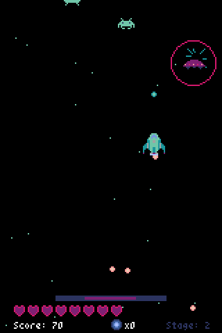
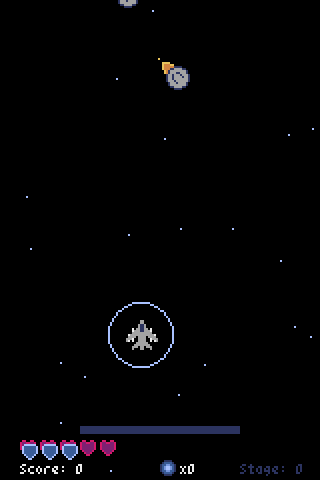
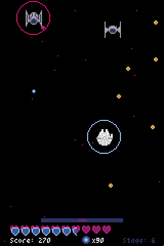

# Dark Matter



## Description
Entry for the [PyWeek 36 Game Jam](https://pyweek.org/e/RicBin36/), the theme of the Jam was ***'Dark Matter'***.

You are in space looking into the asteroids for dark matter, high value material, suddenly you are attacked by space ships. Survive and collect the dark matter and buy better ships.

## Game Play
[Go to YouTube](https://youtu.be/EZRpdbXrD7M)




## Requirements:
- Python version 3.10.4
- Pyxel version 1.9.18

*The game was only tested on these versions*

## How to run
To run the code, install all the dependencies from `requirements.txt` and run the `scr` folder. You can use the following steps:

```py
pip install -r requirements.txt
py scr
```

You can also [play it in the browser](https://rickbi.github.io/Pyweek36/)

## How to Play
- Move with the `UP`, `DOWN`, `LEFT` and `RIGHT` arrows
- Press `A` key to select and shoot
- Press `Z` key to go back in the menus
- Hold `S` and `X` at the same time to self-destruct
- Press `F4` to quit
- Press `ALT` + `ENTER` to toggle full screen
- When an enemy is destroyed it will span either health, shield or dark matter

## Assets
All the assets were made by me, using the Pyxels Image and Sound Editors. Highly inspired by the spaceships of Space Invaders, Star Wars, Star Trek, batman, Futurama and Dune.

## Thanks for Playing
